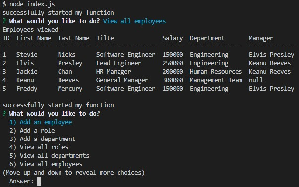

# Employee Tracker

## Description
The aim of this project was to create a command line application that allows employers to view and alter their employee's details with ease. The employee's details are stored in a database using MySQL and the application is run using node.js. To see how the application works, click to view a video [demonstration](https://drive.google.com/file/d/1LDyILeohtpN0Hqt7saTsXdz5xN89tviS/view).

## Table of Contents 

* [Installation](#installation)
* [Usage](#usage)
* [License](#License)
* [Contributing](#contributing)
* [Test](#test)
* [Questions](#questions)

## Installation
The technologies used for this project include MySQL, Node.js, Inquirer npm package, MySQL npm package, console.table npm package and JavaScript. First install Node.js and all the npm packages. Then copy the MySQL files into your MySQL workbench and run both of the files. Ensure the username and password for MySQL are correct in your index.js file. Then start the application by running the command ---node index.js.

## Usage
The following image shows an example of how the application works. 

## License 
Permission is hereby granted, free of charge, to any person obtaining a copy of this software and associated documentation files(the "Software"), to deal in the Software without restriction, including without limitation the rights to use, copy, modify, merge, publish, distribute, sublicense, and / or sell copies of the Software, and to permit persons to whom the Software is furnished to do so, subject to the following conditions: The above copyright notice and this permission notice shall be included in all copies or substantial portions of the Software. THE SOFTWARE IS PROVIDED "AS IS", WITHOUT WARRANTY OF ANY KIND, EXPRESS OR IMPLIED, INCLUDING BUT NOT LIMITED TO THE WARRANTIES OF MERCHANTABILITY, FITNESS FOR A PARTICULAR PURPOSE AND NONINFRINGEMENT.IN NO EVENT SHALL THE AUTHORS OR COPYRIGHT HOLDERS BE LIABLE FOR ANY CLAIM, DAMAGES OR OTHER LIABILITY, WHETHER IN AN ACTION OF CONTRACT, TORT OR OTHERWISE, ARISING FROM, OUT OF OR IN CONNECTION WITH THE SOFTWARE OR THE USE OR OTHER DEALINGS IN THE SOFTWARE.

## Contributing
Anyone can contribute according to the conditions stated in the MIT license.

## Test
No tests are currently available for this application.

## Questions
If you have any questions or would like further information on this project, 
please contact silviataliana2@gmail.com or find me on [Github](https://github.com/silvia-taliana).
